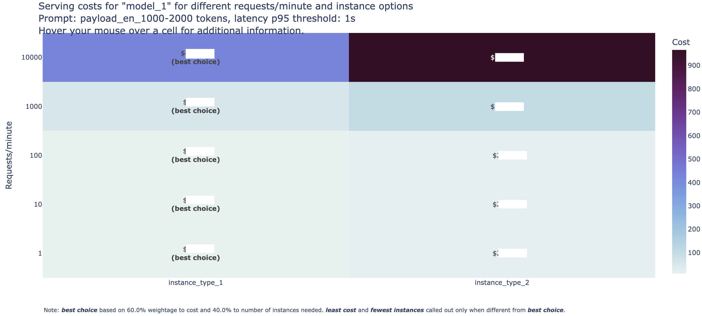

# Generate downstream summarized reports for further analysis

You can use several results from various `FMBench` runs to generate a summarized report of all runs based on your cost, latency, and concurrency budgets. This report helps answer the following question:

_What is the minimum number of instances N, of most cost optimal instance type T, that are needed to serve a real-time workload W while keeping the average transaction latency under L seconds?”_

    W: = {R transactions per-minute, average prompt token length P, average generation token length G}
    

- With this summarized report, we test the following **hypothesis**: At the low end of the total number of requests/minute smaller instances which provide good inference latency at low concurrencies would suffice (said another way, the larger more expensive instances are an overkill at this stage) but as the number of requests/minute increase there comes an inflection point beyond which the number of smaller instances required would be so much that it would be more economical to use fewer instances of the larger more expensive instances.

### An example report that gets generated is as follows:

#### Summary for payload: payload_en_x-y

- The metrics below in the table are examples and do not represent any specific model or instance type. This table can be used to make analysis on the cost and instance maintenance perspective based on the use case. For example, `instance_type_1` costs 10 dollars and requires 1 instance to host `model_1` until it can handle 100 requests per minute. As the requests scale to a 1,000 requests per minute, 5 instances are required and cost 50 dollars. As the requests scale to 10,000 requests per minute, the number of instances to maintain scale to 30, and the cost becomes 450 dollars. 

- On the other hand, `instance_type_2` is more costly, with a price of $499 for 10,000 requests per minute to host the same model, but only requires 22 instances to maintain, which is 8 less than when the model is hosted on `instance_type_1`. 

- Based on these summaries, users can make decisions based on their use case priorities. For a real time and latency sensitive application, a user might select `instance_type_2` to host `model_1` since the user would have to maintain 8 lesser instances than hosting the model on `instance_type_1`. Hosting the model on `instance_type_2` would also maintain the `p_95 latency` (0.5s), which is half compared to `instance_type_1` (`p_95 latency`: 1s) even though it costs more than `instance_type_1`. On the other hand, if the application is cost sensitive, and the user is flexible to maintain more instances at a higher latency, they might want to shift gears to using `instance_type_1`.

- Note: _Based on varying needs for prompt size, cost, and latency, the table might change._

| experiment_name | instance_type | concurrency | latency_p95 | transactions_per_minute | instance_count_and_cost_1_rpm | instance_count_and_cost_10_rpm | instance_count_and_cost_100_rpm | instance_count_and_cost_1000_rpm | instance_count_and_cost_10000_rpm |
|-----------------|---------------|-------------|-------------|--------------------------|-------------------------------|--------------------------------|---------------------------------|----------------------------------|----------------------------------|
| model_1         | instance_type_1 | 1           | 1.0         | _                        | (1, 10)                       | (1, 10)                        | (1, 10)                         | (5, 50)                          | (30, 450)                        |
| model_1         | instance_type_2 | 1           | 0.5         | _                        | (1, 10)                       | (1, 20)                        | (1, 20)                         | (6, 47)                          | (22, 499)                        |

### FMBench Heatmap

This step also generates a heatmap that contains information about each instance, and how much it costs with per `request-per-minute` (`rpm`) breakdown. The default breakdown is [1 `rpm`, 10 `rpm`, 100 `rpm`, 1000 `rpm`, 10000 `rpm`]. View an example of a heatmap below. The model name, instance type, is masked but can be generated for your specific use case/requirements.



## Steps to run analytics

1. Clone the `FMBench` repo from GitHub.

1. Place all of the `result-{model-id}-...` folders that are generated from various runs in the top level directory.

1. Run the following command to generate downstream analytics and summarized tables. Replace `x`, `y`, `z` and `model_id` with the latency, concurrency thresholds, payload file of interest (for example `payload_en_1000-2000.jsonl`) and the `model_id` respectively. The `model_id` would have to be appended to the `results-{model-id}` folders so the [analytics.py](analytics/analytics.py) file can generate a report for all of those respective result folders. 

    ```{.bash}
    python analytics/analytics.py --latency-threshold x --concurrency-threshold y  --payload-file z --model-id model_id
    ```

