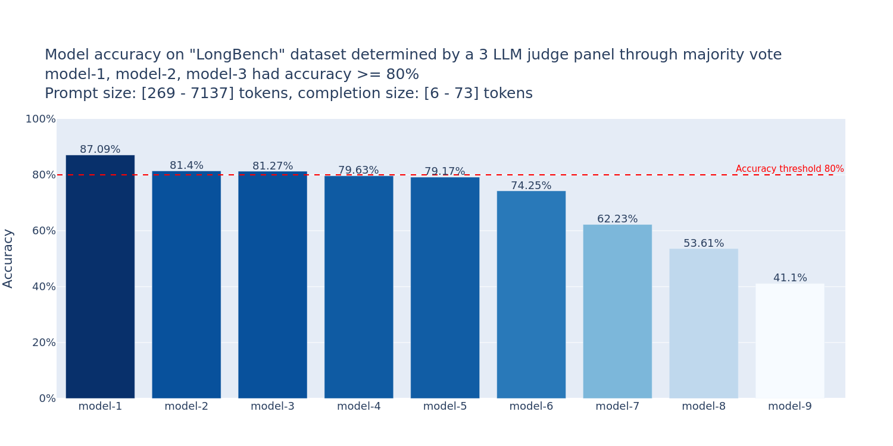

# Benchmark foundation models on AWS

`FMBench` is a Python package for running performance benchmarks for **any Foundation Model (FM)** deployed on **any AWS Generative AI service**, be it **Amazon SageMaker**, **Amazon Bedrock**, **Amazon EKS**, or **Amazon EC2**. The FMs could be deployed on these platforms either directly through `FMbench`, or, if they are already deployed then also they could be benchmarked through the **Bring your own endpoint** mode supported by `FMBench`. 

Here are some salient features of `FMBench`:

1. **Highly flexible**: in that it allows for using any combinations of instance types (`g5`, `p4d`, `p5`, `Inf2`), inference containers (`DeepSpeed`, `TensorRT`, `HuggingFace TGI` and others) and parameters such as tensor parallelism, rolling batch etc. as long as those are supported by the underlying platform. 

1. **Benchmark any model**: it can be used to be benchmark _open-source models_, _third party models_, and _proprietary models_ trained by enterprises on their own data.

1. **Run anywhere**: it can be run on any AWS platform where we can run Python, such as Amazon EC2, Amazon SageMaker, or even the AWS CloudShell. _It is important to run this tool on an AWS platform so that internet round trip time does not get included in the end-to-end response time latency_.

## The need for benchmarking

<!-- markdown-link-check-disable -->
Customers often wonder what is the best AWS service to run FMs for _my specific use-case_ and _my specific price performance requirements_. While model evaluation metrics are available on several leaderboards ([`HELM`](https://crfm.stanford.edu/helm/lite/latest/#/leaderboard), [`LMSys`](https://chat.lmsys.org/?leaderboard)), but the price performance comparison can be notoriously hard to find and even more harder to trust. In such a scenario, we think it is best to be able to run performance benchmarking yourself on either on your own dataset or on a similar (task wise, prompt size wise) open-source datasets such as ([`LongBench`](https://huggingface.co/datasets/THUDM/LongBench), [`QMSum`](https://paperswithcode.com/dataset/qmsum)). This is the problem that [`FMBench`](https://github.com/aws-samples/foundation-model-benchmarking-tool/tree/main) solves.
<!-- markdown-link-check-enable -->

## [`FMBench`](https://github.com/aws-samples/foundation-model-benchmarking-tool/tree/main): an open-source Python package for FM benchmarking on AWS

`FMBench` runs inference requests against endpoints that are either deployed through `FMBench` itself (as in the case of SageMaker) or are available either as a fully-managed endpoint (as in the case of Bedrock) or as bring your own endpoint. The metrics such as inference latency, transactions per-minute, error rates and cost per transactions are captured and presented in the form of a Markdown report containing explanatory text, tables and figures. The figures and tables in the report provide insights into what might be the best serving stack (instance type, inference container and configuration parameters) for a given FM for a given use-case.

The following figure gives an example of the price performance numbers that include inference latency, transactions per-minute and concurrency level for running the `Llama2-13b` model on different instance types available on SageMaker using prompts for Q&A task created from the [`LongBench`](https://huggingface.co/datasets/THUDM/LongBench) dataset, these prompts are between 3000 to 3840 tokens in length. **_Note that the numbers are hidden in this figure but you would be able to see them when you run `FMBench` yourself_**.

The following table (also included in the report) provides information about the best available instance type for that experiment1.

|Information	|Value	|
|---	|---	|
|experiment_name	|llama2-13b-inf2.24xlarge	|
|payload_file	|payload_en_3000-3840.jsonl	|
|instance_type	|ml.inf2.24xlarge	|
|concurrency	|**	|
|error_rate	|**	|
|prompt_token_count_mean	|3394	|
|prompt_token_throughput	|2400	|
|completion_token_count_mean	|31	|
|completion_token_throughput	|15	|
|latency_mean	|**	|
|latency_p50	|**	|
|latency_p95	|**	|
|latency_p99	|**	|
|transactions_per_minute	|**	|
|price_per_txn	|**	|

1 ** values hidden on purpose, these are available when you run the tool yourself.

The report also includes latency Vs prompt size charts for different concurrency levels. As expected, inference latency increases as prompt size increases but what is interesting to note is that the increase is much more at higher concurrency levels (and this behavior varies with instance types).

## Determine the optimal model for your generative AI workload

Use `FMBench` to determine model accuracy using a panel of LLM evaluators (PoLL [[1]](#1)). Here is one of the plots generated by `FMBench` to help answer the accuracy question for various FMs on Amazon Bedrock (the model ids in the charts have been blurred out on purpose, you can find them in the actual plot generated on running FMBench).

## References
<a id="1">[1]</a> 
[Pat Verga et al., "Replacing Judges with Juries: Evaluating LLM Generations with a Panel of Diverse Models",    arXiv:2404.18796, 2024.](https://arxiv.org/abs/2404.18796)